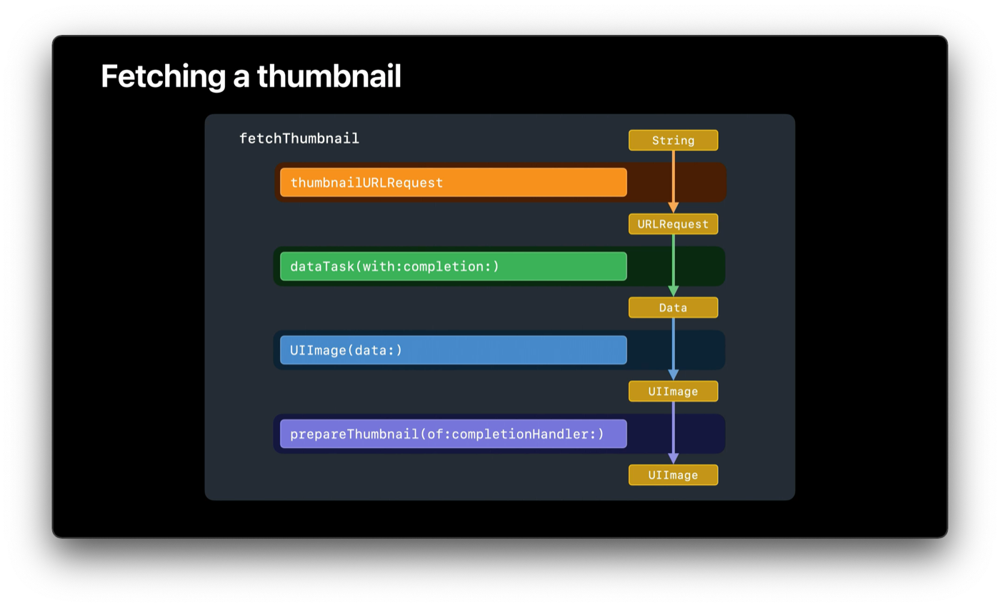
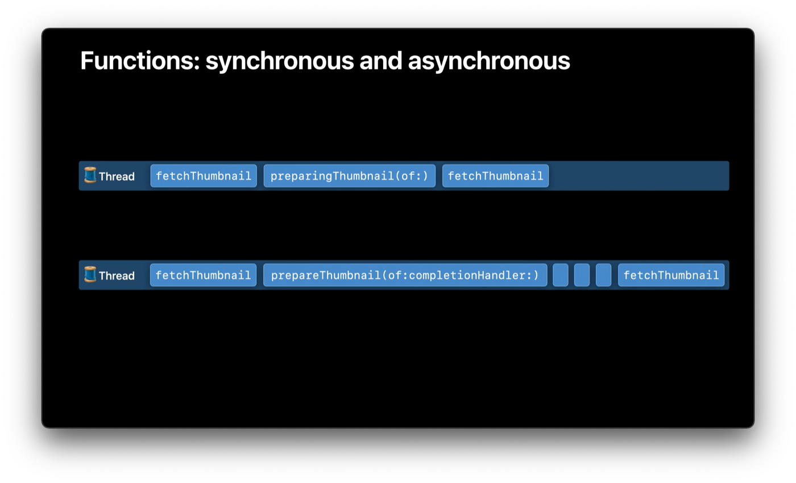

# async/await

## 例の処理


1. サムネイルIDを取得
2. サムネイルIDから`URLRequest`を生成
3. 画像のデータを取得
4. 取得したデータから`UIImage`を生成
5. 画像を新たな画像に変換


## そもそも同期/非同期処理とは

### 同期処理とは
処理の実行中はスレッドで他の処理が実行されない（スレッドがブロックされる）
### 非同期処理とは
実行を開始した処理の完了を待たずに他の処理の実行へと移れる

>iOSアプリ開発ではUIの状態を変更できるのはメインスレッドと呼ばれるスレッドのみです。
なので、時間のかかる処理は別スレッドで非同期的に実行するのが一般的である。


## これまでの非同期関数のよくないところ
``` swift
// "Meet async/await in Swift" 3:43
func fetchThumbnail(for id: String, completion: @escaping (UIImage?, Error?) -> Void) {
    let request = thumbnailURLRequest(for: id)
    let task = URLSession.shared.dataTask(with: request) { data, response, error in
        if let error = error {
            completion(nil, error)
        } else if (response as? HTTPURLResponse)?.statusCode != 200 {
            completion(nil, FetchError.badID)
        } else {
            guard let image = UIImage(data: data!) else {
                completion(nil, FetchError.badImage)
                return
            }
            image.prepareThumbnail(of: CGSize(width: 40, height: 40)) { thumbnail in
                guard let thumbnail = thumbnail else {
                    completion(nil, FetchError.badImage)
                    return
                }
                completion(thumbnail, nil)
            }
        }
    }
    task.resume()
}
```

Swift5.5より前では完了後の処理をクロージャで渡し、その引数で結果を受け取る書き方がよく使われていた。
ただこの書き方には下記3点の懸念点がある。
* 今後の改修やリファクタリングをする上で、completionクロージャーを呼び出し忘れる可能性がある。
* 処理の流れによってはcompletionクロージャーを2回以上呼んでしまったりする可能性がある。
* 同期処理では安全で正しいコードを書くための言語機能によるサポートがあったが、クロージャーを多用した非同期的なコードはその恩恵を受けることができない。


## これからの非同期関数
``` swift
// "Meet async/await in Swift" 8:30
func fetchThumbnail(for id: String) async throws -> UIImage {
    let request = thumbnailURLRequest(for: id)
    let (data, response) = try await URLSession.shared.data(for: request)
    guard (response as? HTTPURLResponse)?.statusCode == 200 else { throw FetchError.badID }
    let maybeImage = UIImage(data: data)
    guard let thumbnail = await maybeImage?.thumbnail else { throw FetchError.badImage }
    return thumbnail
}
```
* 関数に`async`キーワードを付与することで、他の`async`キーワードを付与している関数を関数内から呼び出すことができる。
* `async`が付与された関数を呼び出す際はcompletionクロージャーで完了を受け取る代わりに`await`というキーワードを付与して、処理結果を待つことができる。

### なにがうれしいのか
* コードの行数とネストの深さが減り、コードの可読性が向上する。
* エラーハンドリングに`try`や`throw`を用いることができる。


## `AsyncSequence`
async/awaitと共に追加される機能で、`Sequence`プロトコルのasync/await版のようなもの。

### `Sequence`プロトコルとは
Swiftの標準ライブラリで提供されているプロトコルの一種であり。`Sequence`プロトコルに準拠する方を実装することによって、`for-in`文で順番に要素にアクセスできるようになります。
`Array型`や`Dictionary型`も`Sequence`プロトコルに準拠しているため、`for-in`文で繰り返し処理をすることができます。

``` swift
struct Countdown: Sequence, IteratorProtocol {
    var count: Int
    mutating func next() -> Int? {
        defer { count -= 1 }
        return count == 0 ? nil : count
    }
}


for i in Countdown(count: 3) {
  print(i)
}
// 3
// 2
// 1

Countdown(count: 3).forEach { print($0) }
// 3
// 2
// 1
```

`Foundation`フレームワークの`URL`クラスに追加された`lines`プロパティの`AsyncSequence`を使ったコード例
``` swift
// runable playgound
func readHTML() async throws {
    let url = URL(string: "https://example.com")!
    let lines = url.lines
        .map { (line: String) -> String in
            print("[map] ", line)
            return line.trimmingCharacters(in: .whitespaces)
        }
        .filter { (line: String) -> Bool in
            print("[fil] ", line)
            return line.starts(with: "<meta")
        }
        .prefix(2)

    for try await line in lines {
        print("<for> ", line)
    }
    print("\nEnd")
}

Task {
    do {
        try await readHTML()
    } catch {
        print("ERROR")
    }

}
```


## ☘️ Special Thanks
https://zenn.dev/akkyie/articles/swift-concurrency#mainactor

https://swift.codelly.dev/guide/%E3%82%B3%E3%83%AC%E3%82%AF%E3%82%B7%E3%83%A7%E3%83%B3%E5%9E%8B/Sequence%E3%83%97%E3%83%AD%E3%83%88%E3%82%B3%E3%83%AB.html#%E3%82%AB%E3%82%A6%E3%83%B3%E3%83%88%E3%83%80%E3%82%A6%E3%83%B3%E3%82%92%E5%AE%9F%E8%A3%85